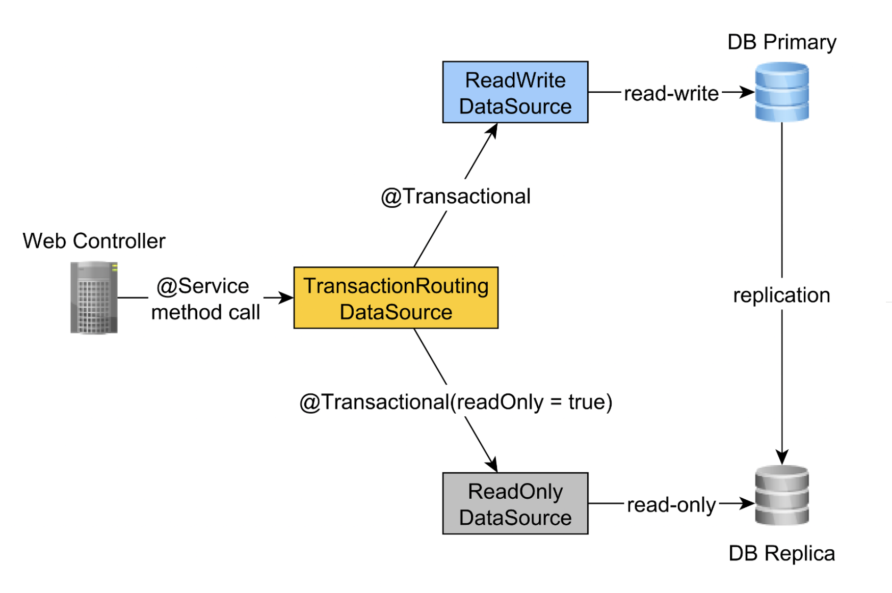

# Transactional Routing

Inside the `TransactionRoutingConfiguration.java` class the `actualDataSource` acts as a facade for the read-write and
read-only data sources and is implemented using the `TransactionRoutingDataSource` utility.

The `readWriteDataSource` is registered using the `DataSourceType.READ_WRITE` key and the `readOnlyDataSource` using the
`DataSourceType.READ_ONLY` key.
So, when executing a read-write `@Transactional` method, the `readWriteDataSource` will be used while when executing a
`@Transactional(readOnly = true)` method, the `readOnlyDataSource` will be used instead.

Basically, we inspect the Spring `TransactionSynchronizationManager` class that stores the current transactional context
to check whether the currently running Spring transaction is read-only or not.
The `determineCurrentLookupKey` method returns the discriminator value that will be used to choose either the read-write
or the read-only JDBC DataSource.

### References

https://vladmihalcea.com/read-write-read-only-transaction-routing-spring/